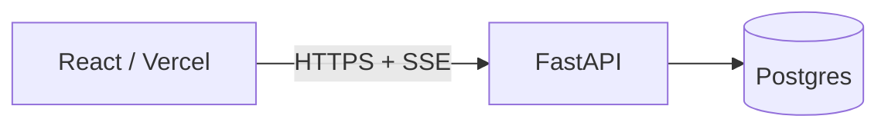

# Documentación OKF de SOMA

Toda la documentación vive en el bundle `C:\proyectos_ia\docs`, en formato
**OKF v0.2** (Open Knowledge Format, spec de Google Cloud). El bundle está
declarado en `index.md` con `okf_version: "0.2"`.

Un archivo = un concepto. El código no es el lugar para registrar decisiones.

## Frontmatter

`type` es el **único campo obligatorio**. Recomendados: `title`, `description`,
`tags`, `status`.

```yaml
---
type: Architecture Decision Record
title: Título legible
description: Una sola frase, para previews y búsqueda.
tags: [soma, adr, data]
status: draft            # draft | stable | deprecated
generated: { by: human:product-soma, at: 2026-08-24T00:00:00Z }
sources:
  - id: current-architecture
    resource: /SOMA.md
    title: Current SOMA architecture
---
```

`type` usado en este bundle: `Architecture Guide`, `Architecture Plan`,
`Architecture Decision Record`, `Diagnostic`, `Governance`, `PRD`, `Runbook`.

### Actores (`generated.by`, `verified[].by`)

- `human:<id>` — persona. **Solo este prefijo cuenta como revisión humana.**
- `<producto>/<versión>` — agente o herramienta, ej. `claude-code/opus-5`.
- `process:<id>` — proceso automático.

Un documento que escribe un agente lleva `generated: { by: claude-code/opus-5 }`.
No marcarlo como `human:` — falsea la señal de confianza del bundle.

### Enlaces

Rutas **absolutas al bundle**, empezando por `/`: `[ADR-003](/SOMA-ADR-003-layering.md)`.
Los enlaces crean aristas del grafo de conocimiento; los consumidores toleran
enlaces rotos, así que se puede enlazar un documento aún no escrito.

## Nombres

`SOMA-<TIPO>-<slug>.md`, y con fecha cuando el documento es un snapshot:

- `SOMA-ADR-003-layering.md`
- `SOMA-DIAGNOSTIC-2026-08-24.md`
- `SOMA-DATA-GOVERNANCE.md`

Archivos reservados: `index.md` (listado del bundle, hay que **actualizarlo** al
agregar un documento) y `log.md` (historial, encabezados `YYYY-MM-DD`, más
reciente arriba).

## Diagramas

**Mermaid dentro del `.md`** es el default: se versiona como texto, renderiza
nativo en GitHub y en Artifacts, y no necesita herramientas.

````markdown

````

Reglas: etiquetas en español, `flowchart LR` para arquitectura, `sequenceDiagram`
para protocolos (login, SSE), `erDiagram` para modelo de datos. Sin colores
hardcodeados — el tema del lector decide.

**draw.io** solo para el diagrama maestro de arquitectura, donde la edición
manual libre aporta. Los `.drawio` son XML plano: se escriben directamente sin
CLI y se abren en diagrams.net.

## Documentos vivos vs. snapshots

- **Vivos** (`SOMA.md`, `SOMA-DATA-GOVERNANCE.md`): se actualizan en sitio. Si
  el código contradice al documento, el documento está mal — corrígelo.
- **Snapshots** (diagnósticos, auditorías, revisiones con fecha en el nombre):
  **no se editan** después de publicados. Un hallazgo nuevo va en un diagnóstico
  nuevo que enlaza al anterior.

Un ADR aceptado tampoco se edita: se supera con otro ADR que lo marque
`status: deprecated` y explique por qué.
