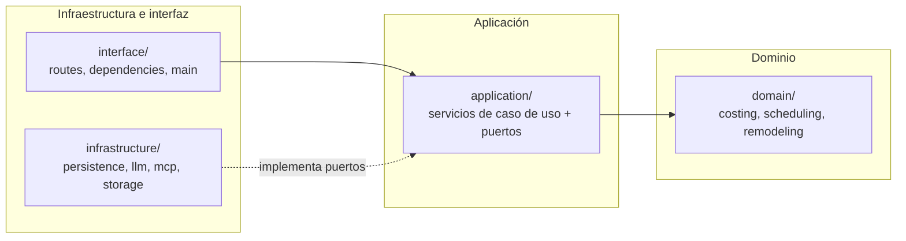

# ADR-003: capas hexagonales, fronteras y protocolos

**Estado:** propuesta

**Fecha:** 2026-08-24

**Relación con ADR-001:** lo extiende, no lo reemplaza. ADR-001 decidió *dónde
se despliega* cada cosa; este decide *cómo se ordena el código por dentro*.

# Contexto

El diagnóstico muestra que la lógica de costeo AIU y de cronograma vive dentro
de handlers HTTP, y que `agent.py` mezcla dominio, aplicación e infraestructura.
La consecuencia es que las reglas de negocio no se pueden testear sin levantar
FastAPI ni reutilizar fuera de una petición HTTP.

Existía además la duda de si separar backend, agente y base de datos en
repositorios distintos para lograr "clean architecture".

# Decisión 1: la separación es de capas, no de repositorios

**Se mantiene un único repositorio.** Clean architecture es una regla sobre la
*dirección de las dependencias entre módulos*, no sobre el número de repos. Un
monorepo con capas estrictas cumple el objetivo; varios repos sin capas no lo
cumplen y además añaden contratos de red, versionado cruzado y despliegues
coordinados.

A escala de una persona, partir repos cuesta: un refactor que cruza capas deja
de ser un commit atómico y pasa a ser una secuencia de PRs con versiones
intermedias rotas. La integración de esta semana se resolvió en un solo merge
precisamente porque todo vive junto.

Se revisará cuando se cumplan **dos** de los criterios de corte ya definidos en
el plan de arquitectura (autoescalado independiente, aislamiento de fallos,
equipos separados, cadencias distintas, fronteras de datos por cumplimiento).

# Decisión 2: cuatro capas con dependencia dirigida hacia adentro

Regla única y verificable: **`domain/` no importa nada de `application/`,
`infrastructure/` ni `interface/`, ni ningún paquete de terceros de framework**
(FastAPI, LangChain, sqlite3). Si un módulo de dominio necesita datos, los recibe
como argumento.

Estructura destino de `api/src/soma_api/`:

| Capa | Contenido | Puede importar |
| --- | --- | --- |
| `domain/` | `costing.py` (AIU, IVA), `scheduling.py` (duración, fases), `remodeling.py`, tipos del dominio | solo stdlib |
| `application/` | Servicios de caso de uso (`ApuService`, `ProjectService`, `AgentService`) y `ports.py` con `Protocol`s | `domain` |
| `infrastructure/` | `persistence/` (migrations, repositories, database), `llm/` (proveedor, grafo), `mcp/` (cliente, política) | `application`, `domain` |
| `interface/` | `routes/`, `dependencies.py`, `main.py` | `application` |

`config.py` y `security.py` quedan como utilidades transversales sin
dependencias internas.

Los **puertos** son `typing.Protocol` declarados en `application/ports.py`
(`ApuRepositoryPort`, `ModelProviderPort`, `DocumentStoragePort`,
`VectorIndexPort`). La infraestructura los implementa; la aplicación solo conoce
el protocolo. Eso es lo que permite cambiar SQLite→Postgres o Chroma→pgvector
sin tocar dominio ni servicios.

## Qué se mueve

| Hoy | Destino |
| --- | --- |
| `routes/construction.py::_apu_view` (costeo AIU) | `domain/costing.py` |
| `routes/construction.py::_project_view` (cronograma) | `domain/scheduling.py` |
| `add_project_partida` (`math.ceil` de duración) | `domain/scheduling.py` |
| `simulation.py::calculate_remodeling` | `domain/remodeling.py` (sin I/O) |
| `simulation.py` carga de `remodeling.yml` | `infrastructure/rules_loader.py` |
| `agent.py::architecture_plan`, `extract_scenario` | `domain/` + `application/agent_service.py` |
| `agent.py::ChatOpenAI`, grafo LangGraph | `infrastructure/llm/` |
| `mcp.py::WRITE_MARKERS` (política) | `application/` (es regla), cliente en `infrastructure/mcp/` |

Los handlers quedan delgados: validar entrada, llamar un servicio, traducir el
resultado o el error a status code.

## Cómo se verifica

Un test de arquitectura que falla si alguien rompe la dirección: recorre los
`import` de cada módulo bajo `domain/` y falla si aparece cualquier módulo de
otra capa o framework. Es más barato que revisarlo en code review.

# Decisión 3: tres protocolos, cada uno con su criterio

No se adopta una cola ni un bus de mensajes de forma general. Se elige por forma
de la interacción:

| Protocolo | Cuándo | Casos en SOMA |
| --- | --- | --- |
| **REST/JSON** | Comando o consulta que responde en < 1 s | login, CRUD de insumos y APUs, crear proyecto, `summary`, simulación de ventas |
| **SSE** | El servidor emite progresivamente y el cliente solo escucha | asesor arquitectónico (`/api/agui/architect`), ya implementado |
| **Cola + job id** | Trabajo largo, con reintentos, que no debe morir con la petición | OCR y parsing de facturas, indexado de embeddings |

**SSE y no WebSocket** para el widget de chat: la comunicación es
unidireccional (servidor → cliente), SSE viaja sobre HTTP normal, reconecta solo
y atraviesa proxies sin negociación de upgrade. WebSocket añadiría estado de
conexión bidireccional que este producto no usa. Requisito operativo: el proxy
no debe bufferizar — `flush_interval -1` ya está en el `Caddyfile`.

**Cola y no llamada síncrona** para documentos: subir un PDF devuelve
`202 Accepted` con un `job_id`; el cliente consulta `GET /api/documents/jobs/{id}`.
El job se modela como máquina de estados (`received`, `extracting`, `validated`,
`indexed`, `failed`, `needs_review`), nunca como un booleano. El registro del job
se persiste **antes** de encolar, para que un reintento no pierda trabajo.

Para un solo usuario la cola no necesita Redis ni broker: una tabla de jobs en
Postgres con `SELECT ... FOR UPDATE SKIP LOCKED` es suficiente y elimina un
servicio de la topología. Se cambia a un broker solo si aparece contención real.

**Llamadas entre servicios:** por ahora no existen. Todo es un proceso FastAPI.
Cuando se extraiga el worker, se comunicará por la tabla de jobs, no por HTTP —
así no hay que autenticar servicio-a-servicio ni manejar reintentos de red.

# Consecuencias

- Las reglas de costeo se vuelven testeables sin FastAPI y reutilizables desde el
  worker y el agente.
- Cambiar de motor de persistencia o de proveedor LLM se limita a
  `infrastructure/`.
- Coste: más archivos y una indirección más. Se acepta porque el costeo AIU es el
  activo del producto y hoy no tiene dónde vivir.
- El movimiento es incremental: cada extracción puede hacerse con los 19 tests
  actuales en verde.

# Rechazado

- **Repos separados por servicio.** Resuelve un problema organizacional que no
  existe con un solo desarrollador.
- **Microservicios por dominio.** El plan de arquitectura ya fijó los criterios
  de corte; ninguno se cumple.
- **WebSockets para el chat.** Bidireccionalidad no usada.
- **Broker de mensajes (Redis/RabbitMQ) desde el inicio.** Una tabla de jobs
  cubre la carga de un usuario sin sumar un servicio que respaldar.
- **Repositorio genérico `Repository<T>`.** Las consultas reales son específicas;
  una abstracción genérica terminaría filtrando SQL igual.
