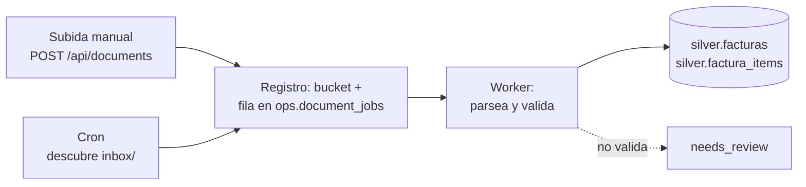

# ADR-006: Ingesta documental

**Estado:** propuesta

**Fecha:** 2026-08-25

# Contexto

Cuatro documentos ya deciden partes de este flujo y **no se rediscuten aquí**:

| Ya decidido | Dónde |
| --- | --- |
| El binario va a un bucket privado; Postgres guarda referencia y hash | [Topología y costos](/SOMA-INFRA-AND-COSTS.md) |
| Esquemas `bronze` / `silver` / `gold` / `ops`; `bronze.documentos_raw`, `ops.document_jobs` | [Gobierno de datos](/SOMA-DATA-GOVERNANCE.md) |
| Estados `received → extracting → validated → indexed`, con `failed` y `needs_review` | [Plan MCP y PDF](/SOMA-MCP-PDF-PLAN.md) |
| Postgres con pgvector como motor único | [ADR-004](/SOMA-ADR-004-postgres-pgvector.md) |

Lo que **ninguno** decide, y es el objeto de este ADR:

1. Cómo llegan los documentos sin que una persona los suba a mano cada vez.
2. Qué proceso los descubre, dónde corre y con qué frecuencia.
3. Cómo se organiza el código de parseo cuando cada emisor produce un formato
   distinto.

**Estado real del código a 2026-08-25** (verificado, no inferido): no existe
Postgres, no existen tablas de documentos ni de jobs, `MIGRATIONS` va por la
versión 6 y `api/pyproject.toml` no declara ninguna dependencia de PDF. Este ADR
describe algo que todavía no existe; [ADR-004](/SOMA-ADR-004-postgres-pgvector.md)
es prerrequisito duro, porque toda la tubería escribe en Postgres.

# Decisión

## 1. Dos puertas de entrada, una sola tubería

La fuente de ingesta es un adaptador reemplazable. Todo lo que ocurre después del
ingreso es idéntico venga de donde venga el documento.



Prohibido: una segunda tubería paralela para el origen automático. Si el cron
necesita lógica que la subida manual no tiene, esa lógica está en el lugar
equivocado.

## 2. El origen canónico es un prefijo `inbox/` del mismo bucket

Los documentos que llegan solos se depositan en `inbox/` del bucket R2 ya
elegido. El cron lista ese prefijo, y por cada objeto no visto crea el job y lo
mueve a su ubicación definitiva por `content_hash`.

Correo y Drive **no** son orígenes canónicos. Si las facturas llegan por correo,
una regla del cliente de correo —o un adaptador IMAP posterior— deposita el
adjunto en `inbox/`. El sistema no aprende a hablar IMAP; aprende a leer un
prefijo de bucket.

La razón: el bucket es la única pieza que no depende de la plataforma de
despliegue. Se habla por API S3 desde cualquier lado, y cambiar de proveedor de
hosting no toca la ingesta.

## 3. El disparo es un cron de la plataforma, no un demonio propio

Verificado en la documentación de ambos proveedores:

| | Render | Railway |
| --- | --- | --- |
| Mecanismo | Tipo de servicio nativo *Cron Job* | Campo *Cron Schedule* en un servicio |
| Imagen | La misma imagen Docker, comando distinto | El start command del servicio |
| Intervalo mínimo | expresión cron estándar | **5 minutos** |
| Duración máxima | 12 horas | debe terminar y salir |
| Solapamiento | **Garantiza una sola corrida activa** | Salta la ejecución si la anterior vive |
| Costo | Mínimo **$1/mes por cron**, fuera del plan free | Dentro del servicio |

**Se elige Render.** Tres razones, en orden:

1. La garantía de *una sola corrida activa* elimina por construcción que dos
   ejecuciones tomen el mismo archivo. Railway ofrece protección equivalente por
   otra vía (saltar la ejecución), pero la garantía explícita es más fuerte.
2. Reutiliza `api/Dockerfile` tal cual, cambiando solo el comando. No hay una
   segunda imagen que mantener ni que pueda desincronizarse.
3. Ya existe en la máquina un `render.yaml` probado en otro proyecto, que además
   documenta algo relevante para SOMA: **Render no corta conexiones largas**
   (sostiene respuestas de 1 a 9 minutos), lo cual respalda el SSE del asesor
   —el requisito que hoy depende de `flush_interval -1` en Caddy.

El cron **no ejecuta migraciones**. El esquema lo migra el API al arrancar; si el
cron encuentra un esquema que no esperaba, falla ruidosamente en vez de intentar
repararlo. Dos procesos migrando compiten y corrompen.

**Frecuencia inicial: cada hora.** A decenas de facturas por mes, más frecuencia
solo compra latencia que nadie percibe.

**Cota por corrida:** procesar como máximo N documentos por ejecución (arranque:
N=20). Una corrida siempre debe terminar; si quedan documentos, los toma la
siguiente. Sin cota, un lote grande convierte el cron en un proceso colgado.

A este volumen, descubrir y procesar ocurren en el mismo proceso. Separarlos en
dos servicios es correcto a escala mayor y prematuro hoy: `ops.document_jobs` ya
guarda el estado, que es lo que hace posible separarlos después sin rediseñar.

## 4. XML DIAN antes que PDF

En Colombia la factura electrónica **es** el XML UBL de la DIAN; el PDF es su
representación gráfica. Parsear el PDF cuando existe el XML es reconstruir a mano
—con heurísticas y a veces OCR— un dato que ya viene estructurado y firmado.

Orden de preferencia del pipeline:

1. **XML DIAN** presente → parseo determinista de campos conocidos. Sin OCR, sin
   heurística, sin ambigüedad.
2. **PDF con capa de texto** → extracción con PyMuPDF/pdfplumber y parser por
   emisor.
3. **PDF escaneado** → OCR, y el resultado entra a `needs_review` por defecto. Un
   número leído por OCR no se acepta sin que una persona lo confirme.

Ambos formatos, cuando llegan juntos, se guardan en `bronze`: el PDF es lo que la
persona reconoce visualmente y el XML es de donde salen las cifras.

## 5. Un parser por emisor, detrás de un puerto único

El pipeline no conoce proveedores. Conoce un protocolo:

```python
class ParserFactura(Protocol):
    nombre: str

    def reconoce(self, doc: DocumentoCrudo) -> bool:
        """¿Este parser sabe leer este documento? Sin efectos secundarios."""

    def extraer(self, doc: DocumentoCrudo) -> FacturaExtraida:
        """Campos tipados. No escribe en base ni decide si son correctos."""
```

Un registro ordenado prueba los parsers y **gana el primero que reconoce**. El
último de la lista es un parser genérico. Si ninguno reconoce, el documento va a
`needs_review` — nunca se descarta ni se adivina.

Agregar un proveedor es agregar una clase y una entrada al registro. No toca el
cron, ni el worker, ni las rutas.

**El reproceso es la razón de ser de `bronze`.** Cuando un parser mejora, se
reprocesan los documentos afectados: se borra lo que ese `documento_id` escribió
en `silver` y se vuelve a parsear el original. Nunca se re-ingiere, nunca se edita
`silver` a mano.

## 6. El parser propone, la aritmética dispone

Un documento pasa a `validated` solo si cuadra consigo mismo:

- la suma de los ítems coincide con el subtotal;
- subtotal más impuestos coincide con el total;
- la diferencia queda dentro de una tolerancia declarada y registrada.

Si no cuadra, va a `needs_review`. **No entra a `silver` un número que no cierra**
—`silver` es la fuente de verdad numérica según el gobierno de datos, y una
fuente de verdad que admite datos sin verificar deja de serlo.

Un LLM **puede** proponer el mapeo de un documento que ningún parser reconoció, y
esa propuesta se muestra en la pantalla de revisión para que una persona la
confirme. **No puede** escribir en `silver` directamente. Es el invariante 5
aplicado a la ingesta: el modelo lee, Python calcula, la persona confirma lo
dudoso.

El texto extraído de un documento es **contenido no confiable**: no puede originar
SQL, shell, filesystem ni llamadas a herramientas con escritura.

# Consecuencias

- La ingesta deja de depender de que alguien se acuerde de subir archivos.
- Aparece un costo fijo nuevo: **$1/mes** del cron en Render, fuera del plan free.
- `content_hash` hace la tubería idempotente de extremo a extremo: el cron puede
  correr de más, reintentar o solaparse sin duplicar una factura.
- **Aparece una pantalla obligatoria**: sin UI de `needs_review`, un documento que
  no valida desaparece en silencio, que es peor que no procesarlo. Es criterio de
  aceptación, no mejora posterior.
- El API gana dependencias de parseo (PyMuPDF/pdfplumber, OCR opcional) y crece la
  imagen Docker. Si el OCR pesa demasiado, se separa en su propia imagen — el
  puerto del parser ya permite hacerlo sin tocar el resto.
- Los parsers son el punto que más va a cambiar. Por eso están detrás de un
  protocolo y por eso `bronze` es inmutable.

# Rechazado

- **Google Drive como origen.** OAuth, tokens que caducan y una API más para el
  mismo resultado que listar un prefijo de bucket.
- **IMAP como origen canónico.** Credenciales, MIME, adjuntos basura y un formato
  de correo por proveedor. Queda como adaptador opcional que deposita en `inbox/`.
- **Un worker demonio siempre encendido.** Paga 24/7 por minutos de trabajo al día.
  Se justifica cuando la ingesta sea continua, no antes.
- **Notificaciones de evento del bucket en la primera versión.** R2 puede disparar
  al subir un objeto y eliminar el cron; es la evolución natural, pero exige una
  cola y no se puede probar en local tan fácil como un cron.
- **Un LLM como parser primario.** No determinista, caro por documento, y
  convierte al modelo en fuente de verdad numérica.
- **Guardar los binarios en Postgres.** Infla cada respaldo y consume el plan free
  de Neon (0,5 GB) en pocas decenas de facturas.

# Verificación

Esta decisión se considera implementada cuando:

1. Un archivo depositado en `inbox/` aparece como fila en `silver.facturas` sin
   intervención manual.
2. Depositar el **mismo** archivo dos veces produce una sola factura.
3. Un documento con totales que no cuadran queda en `needs_review` y es visible en
   la UI.
4. Mejorar un parser y reprocesar cambia `silver` sin volver a subir el archivo.
5. Existe una prueba automatizada de cada punto anterior. Las tres primeras se
   pueden probar contra un bucket local compatible con S3; no requieren desplegar.
