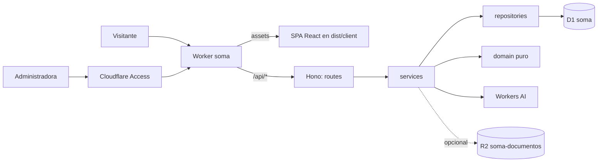

# ADR-009: Todo SOMA en Cloudflare

## Estado

Aceptada y en producción desde el commit `e5002bc`
(`https://soma.mireya-compromisos.workers.dev`). El ADR se escribe después del
cambio: la decisión ya estaba en el código, pero la documentación seguía
describiendo FastAPI y Render, y cada sesión nueva partía de un stack que ya no
existe.

## Contexto

El ADR-008 eligió Render (web y API) y Neon (Postgres) por ~$1/mes, aceptando
que el API gratuito duerme y la primera petición tarda decenas de segundos. En
la práctica eso pesa más de lo previsto:

- Son dos lenguajes (Python y JS) y dos proveedores de ejecución, más un
  proveedor de datos y otro de modelos, para **un solo usuario**.
- La API dormida rompe la primera impresión del sitio de ventas, que es
  justamente la cara pública.
- El asesor necesitaba un proveedor de LLM con clave propia, con coste por
  token y un secreto más que custodiar.

El plan gratis de Cloudflare cubre el mismo producto sin sueño en frío: Workers
(100 000 peticiones/día), D1 (5 GB), Workers AI (10 000 neuronas/día), Access
(hasta 50 usuarios) y R2 (10 GB, requiere activarlo en el dashboard).

## Decisión

Un solo Worker (`wrangler.jsonc`, `name: soma`) sirve la SPA y el API:

- **Ejecución**: Hono en TypeScript, `run_worker_first` solo para `/api/*`; el
  resto son assets estáticos. Se construye con `@cloudflare/vite-plugin`.
- **Datos**: D1 (SQLite). El esquema cambia solo con archivos en
  `migrations/`. El dinero se guarda en **centavos enteros** y se calcula con
  `big.js`.
- **Capas** (ADR-003, sin cambios): `routes → services → repositories`, y
  `domain/` puro compartido con la UI. `tests/architecture/` lo verifica.
- **IA**: Workers AI para el asesor público y el copiloto de admin, vía un
  endpoint AG-UI propio consumido con CopilotKit. Tope diario global en D1
  (`uso_asesor`) y límite por IP con el binding `ASESOR_LIMITE` (8 por 60 s).
- **Acceso**: Cloudflare Access delante de `/admin` y `/api/admin`, más una
  lista `ADMIN_EMAILS` (secreto) que valida el Worker. Ya no hay usuario ni
  contraseña propios.
- **Archivos**: R2 (`FILES`) queda comentado hasta activarlo. Mientras tanto,
  las facturas se extraen en el navegador con pdf.js y el Worker revalida lo
  extraído.

## Consecuencias

- **Coste**: $0 mientras se respeten los límites del plan gratis. El panel de
  consumo de `/admin` los muestra.
- **Se retira**: `api/` (FastAPI), `render.yaml`, Vercel y Caddy.
  **Sustituye** al ADR-008 (proveedores) y al ADR-004 (Postgres + pgvector:
  hoy no hay embeddings; si hicieran falta, la opción natural es Vectorize, y
  eso pediría otro ADR).
- **Deja sin efecto**:
  - ADR-001: la parte de FastAPI y los proveedores. La frontera web / API /
    agente sigue en pie, ahora como capas del mismo Worker.
  - ADR-002: LangGraph y SSE, que pasan a ser AG-UI sobre Workers AI. MCP no
    está implementado.
  - ADR-006: el cron de Render. La ingesta hoy es manual desde `/admin`.
- **Monorepo**: el front y el back no se dividen en repos. Comparten `domain/`
  y se despliegan juntos en un solo `wrangler deploy`; separarlos duplicaría el
  dominio o exigiría publicar un paquete, y a esta escala no compra nada.
- **Límites aceptados**: Workers AI no es el mejor modelo disponible, y los
  números nunca salen del LLM (los calcula `domain/`). D1 no admite
  transacciones interactivas: las operaciones de varios pasos van en
  `db.batch`.
- **Cuándo revisar**: si el uso diario supera los límites gratis, pasar a
  Workers Paid ($5/mes) antes que cambiar de proveedor.
