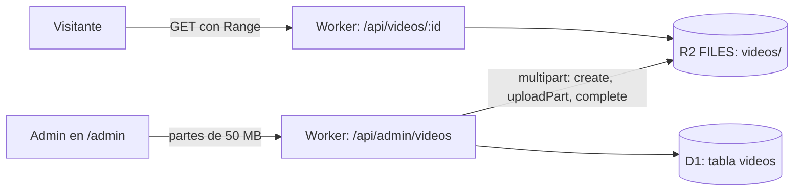

# ADR-010: Videos de obra en R2

## Estado

Propuesta. Espera a que se active R2 en el dashboard de Cloudflare. Ese paso lo
hace la persona, una sola vez, y también habilita la carga de facturas, que hoy
responde 503 porque falta el binding `FILES`.

## Contexto

Hoy el único video, el del dron de la portada (2,8 MB), va dentro del repo en
`assets/` y se publica con cada deploy. Eso no escala a lo que se quiere:

- **Git** no es sitio para binarios grandes: cada versión queda para siempre en
  el historial.
- **Los assets del Worker** tienen un tope de 25 MiB por archivo, y cambiar un
  video exige un deploy.
- **El cuerpo de una petición** a un Worker del plan gratis admite como mucho
  100 MB, así que un video de obra de varios cientos de MB no entra de una vez.

Límites del plan gratis de R2: 10 GB guardados, 1 M operaciones de clase A
(escritura) y 10 M de clase B (lectura) al mes. La salida de datos es gratis.

## Decisión propuesta

1. **Subida multiparte por el Worker**, con la API multiparte del binding:
   `createMultipartUpload`, un `uploadPart` por cada trozo de 50 MB que manda el
   navegador, y `complete`. No hace falta ningún secreto nuevo. Todo va detrás
   de Access y de `ADMIN_EMAILS`, como el resto de `/api/admin`.
2. **Metadatos en D1**, en una tabla `videos` (migración nueva): clave en R2,
   título, tamaño, tipo, póster, estado (`subiendo`, `listo`) y fecha. La UI
   solo lista los videos `listo`.
3. **Reproducción por el Worker** con soporte de `Range`: lee `R2.get(key,
   { range })`, responde `206` y lleva `Cache-Control` largo. Así el `<video>`
   puede adelantar sin descargar todo el archivo.
4. **Sin transcodificar.** Se sube MP4 H.264 ya comprimido; la UI lo advierte
   y rechaza otros tipos. Tope propuesto: 500 MB por video.

## Alternativas descartadas

- **Cloudflare Stream**: transcodifica y adapta la calidad, pero es de pago
  (desde $5/mes). Se reconsidera si los videos pasan de ser pocos y cortos.
- **URLs prefirmadas de S3 hacia R2**: el navegador sube directo sin pasar por
  el Worker, pero exigen un token de API de R2 como secreto del Worker. A escala
  de una persona, pasar por el Worker cuesta unas pocas peticiones más, y no
  pide otro secreto.
- **Bucket público `r2.dev`**: Cloudflare lo limita en tasa y no lo recomienda
  para producción. Además saltaría los encabezados y la CSP del Worker.
- **Seguir en `assets/`**: sirve para el video de la portada, que casi no
  cambia, pero no para los que sube la dueña.

## Consecuencias

- Cada trozo del video y cada rango servido es una petición al Worker (tope de
  100 000 al día). Para un solo usuario y pocas visitas sobra. El panel de
  consumo de `/admin` debería mostrar también R2.
- Si una subida queda a medias, quedan partes huérfanas en R2. Hace falta
  `abortMultipartUpload` al cancelar, y una limpieza de las filas que sigan en
  `subiendo` tras 24 h.
- La CSP (`public/_headers`) ya tiene `media-src 'self'`, así que no cambia
  mientras el video se sirva por el mismo origen.

## Preguntas abiertas (las decide la dueña)

- ¿Los videos son públicos, en la portada o la galería de obras, o solo
  internos para el panel? Si son internos, la ruta de reproducción va detrás de
  Access.
- ¿Tope de 500 MB por video, o más?
