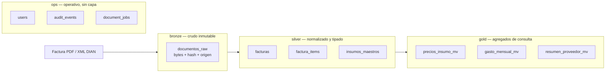

# Alcance

Documento **normativo**: define cómo se nombran, clasifican y evolucionan las
tablas de SOMA. Es un documento vivo — se actualiza en sitio cuando cambia una
regla.

Aplica al motor Postgres definido en [ADR-004](/SOMA-ADR-004-postgres-pgvector.md).
Mientras el motor siga siendo SQLite, aplican las reglas de clasificación y
nomenclatura; las de esquema quedan pendientes.

# Regla 1: el medallón cubre documentos, no todo el modelo

Las capas bronze/silver/gold son un patrón analítico. Se aplican **solo al flujo
de ingesta de facturas**, que sí tiene la forma "dato crudo → dato limpio →
agregado". Las tablas operativas que sirven la UI transaccional (usuarios,
auditoría, migraciones) **no llevan capa**: añadirles medallón sería ceremonia
sin lector analítico que la justifique.

Se implementan como **esquemas de Postgres**: `bronze`, `silver`, `gold`, `ops`.
No como prefijos de nombre — el esquema da permisos y espacio de nombres reales.

| Capa | Contrato | Mutabilidad |
| --- | --- | --- |
| `bronze` | El documento tal como llegó, con hash de contenido y procedencia. Nunca se corrige aquí. | Solo INSERT |
| `silver` | Parseado, tipado, deduplicado y ligado al catálogo maestro. Es la fuente de verdad numérica. | INSERT + UPDATE controlado |
| `gold` | Derivado y **recalculable**. Se puede borrar entero y reconstruir desde silver. | TRUNCATE + rebuild |
| `ops` | Estado operativo de la aplicación. | Según clase de tabla |

Consecuencia práctica: si una factura se parseó mal, se corrige el parser y se
reprocesa desde `bronze`. Nunca se edita a mano en `silver` sin dejar registro,
porque entonces el reproceso la pisaría.

# Regla 2: toda tabla declara su clase

Cuatro clases. La clase determina qué operaciones son legales:

| Clase | Regla | UPDATE | DELETE | Ejemplos |
| --- | --- | --- | --- | --- |
| **Maestra** | Entidad de referencia con clave natural única. Mutable, sin historia. | Sí | Solo si no tiene hijos | `insumos_maestros`, `users`, `apus` |
| **Transaccional** | Hecho ocurrido. Append-only en operación normal. | Solo corrección con auditoría | No | `facturas`, `factura_items`, `proyecto_partidas` |
| **Log** | Registro append-only puro. | **Nunca** | Solo por retención | `audit_events` |
| **Derivada** | Calculable desde otras tablas. | Reconstrucción completa | Sí, es seguro | `proyecto_resultados`, todo `gold` |

Regla de oro: **si una tabla se puede reconstruir, es derivada y no necesita
respaldo**. Si no se puede, necesita respaldo probado.

## Incrementalidad

Una tabla es de carga incremental si tiene una columna monótona que permite
retomar desde el último punto procesado:

- `bronze.documentos_raw`: incremental por `ingested_at` + `content_hash` para
  idempotencia. Reprocesar el mismo archivo no debe duplicar filas.
- `silver.*`: incremental por `documento_id`. El reproceso de un documento borra
  y reinserta **solo sus** filas hijas, en una transacción.
- `gold.*`: recálculo completo mientras el volumen sea bajo. Se pasa a
  incremental solo cuando el recálculo supere unos segundos.

`ops.audit_events` es incremental por `created_at` y **solo se lee hacia
adelante**.

# Regla 3: nomenclatura

- Tablas: `snake_case`, **plural**, en español (el dominio es español):
  `facturas`, `insumos_maestros`.
- Claves primarias: `<singular>_id` (`factura_id`), no `id` genérico — evita
  ambigüedad al hacer joins.
- Claves foráneas: mismo nombre que la primaria referenciada.
- Fechas: sufijo que indique semántica — `_at` para instantes (`created_at`,
  `ingested_at`), `fecha_` para fechas de negocio (`fecha_factura`).
- Booleanos: prefijo `is_` / `has_` (`is_active`).
- Vistas materializadas de `gold`: sufijo `_mv`.
- Dinero: siempre `NUMERIC(14,2)`. **Nunca `REAL`/`FLOAT`.**
- Índices: `idx_<tabla>_<columnas>`; únicos: `uq_<tabla>_<columnas>`.

Prohibido: prefijos de entorno en nombres de tabla (`dev_`, `stg_`). Los
entornos se separan por branch de base de datos, no por nombre.

# Regla 4: entornos

| Entorno | Branch Neon | Datos | Quién escribe |
| --- | --- | --- | --- |
| `production` | `main` | Reales | Solo la app desplegada |
| `staging` | `stg` | Copia anonimizada o sintética | Releases de verificación |
| `development` | `dev` | Sintéticos | Local, destructivo |

Las mismas migraciones corren en los tres, en el mismo orden. Una migración que
solo funciona en un entorno está mal escrita.

# Regla 5: evolución del esquema

- Solo por migraciones versionadas (ver skill `soma-data-layer`).
- Una migración aplicada **nunca se edita ni se renumera**. Se corrige con otra.
- Toda migración es idempotente (`IF NOT EXISTS`).
- Cambios destructivos (`DROP COLUMN`, cambio de tipo con pérdida) requieren
  migración en dos fases: primero escribir en ambas formas, después retirar la
  antigua — para poder revertir el despliegue sin perder datos.

# Regla 6: retención y datos sensibles

| Tabla | Retención | Nota |
| --- | --- | --- |
| `bronze.documentos_raw` | Indefinida | Es el original; sin él no hay reproceso |
| `silver.*` | Indefinida | Fuente de verdad numérica |
| `gold.*` | Reconstruible | Sin respaldo necesario |
| `ops.audit_events` | 12 meses | Purga por `created_at` |
| `ops.document_jobs` | 90 días tras estado terminal | El resultado ya está en silver |

Los detalles de auditoría se redactan **antes** de persistir: `repositories.py`
ya elimina claves que contengan `password`, `token`, `secret`, `api_key`,
`authorization`, `cookie`, `credential`. Toda ampliación de auditoría debe pasar
por esa función, no escribir `details` en crudo.

Las facturas contienen NIT y datos de proveedor: son datos de terceros. No deben
salir del entorno de producción sin anonimizar, y `staging` no recibe copias
directas de producción sin ese paso.
