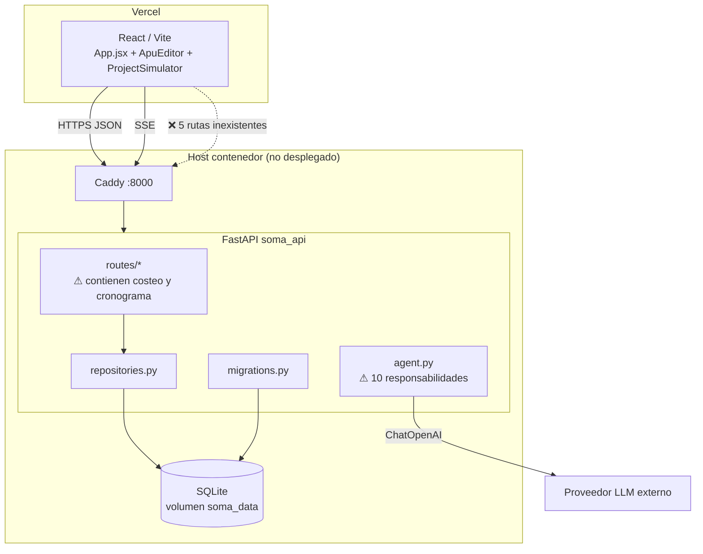

# Alcance

Snapshot de la rama `integracion/develop-merge` del repositorio
`Proyecto-SOMA`, después de integrar el control plane de construcción (insumos,
APUs, proyectos) con la capa de migraciones y repositorios.

Este documento es un **snapshot**: no se edita. Un hallazgo posterior va en un
diagnóstico nuevo.

# Resumen

El sistema tiene una base de seguridad y persistencia sólida (migraciones
versionadas, repositorios, JWT, auditoría, request-id, CORS restringido). El
problema no es la infraestructura: es que **una parte visible del producto no
existe detrás de la pantalla**, y que la lógica de negocio se está acumulando en
la capa HTTP.

Severidad de los hallazgos:

| # | Hallazgo | Severidad |
| --- | --- | --- |
| H1 | 5 endpoints llamados por la UI no existen | Crítica |
| H2 | `/api/admin/summary` devuelve ceros hardcodeados | Crítica |
| H3 | Lógica de costeo y cronograma dentro de `routes/` | Alta |
| H4 | `agent.py` concentra 10 responsabilidades | Alta |
| H5 | Ciclo `database ↔ repositories` con import diferido | Media |
| H6 | `migrate_legacy.py` con SQL crudo fuera de repositorios | Media |
| H7 | Sin harness de Claude Code en el repo | Media |
| H8 | Docker nunca ejecutado; sin Postgres ni worker | Media |

# H1 — Superficie muerta en la UI

El frontend llama cinco rutas que **no están registradas en `main.py`**:

| Ruta | Componente que la llama |
| --- | --- |
| `POST /api/pipeline/process` | `Pipeline` (pestaña "Facturas") |
| `POST /api/rag/index` | `Rag` (pestaña "Inteligencia") |
| `POST /api/rag/query` | `Rag` |
| `POST /api/chat` | `Rag` |
| `GET /api/report/excel` | `App` (botón "Descargar Excel") |

Cualquier usuario que toque esas pestañas recibe un error de red. Esto viola el
criterio de aceptación explícito de la Fase 0 del plan de arquitectura: *"el
frontend no puede llamar una ruta no documentada"*.

**Causa raíz — trazabilidad honesta:** la Fase 0 había eliminado
deliberadamente esa UI. Durante el merge de integración se resolvió el conflicto
de `src/App.jsx` tomando la versión del compañero por ser un superset
funcional, sin reconocer que el "recorte" de la otra rama era una decisión de
arquitectura, no una versión atrasada. El merge revirtió trabajo intencional.

**Lección de proceso:** en un conflicto donde un lado *elimina* superficie, la
eliminación puede ser la decisión. Antes de preferir el superset hay que buscar
el ADR que la justifique.

# H2 — El dashboard es una fachada

`routes/summary.py:9-21` no consulta ningún repositorio: devuelve un diccionario
literal en cero.

```python
@router.get("/summary")
def summary(_: dict[str, object] = Depends(current_user)):
    return {"facturas": 0, "items": 0, "total_pagado": 0, ...}
```

Los KPIs del control room siempre muestran cero, independientemente del contenido
de la base. No es un síntoma de base vacía — es un stub. Además, `chroma_count`
expone en el contrato un motor vectorial que no está desplegado.

# H3 — Lógica de negocio en la capa HTTP

El costeo AIU y la planificación de obra —el núcleo del valor del producto— viven
dentro de handlers HTTP en `routes/construction.py`:

- `_apu_view()` (L63-82): costo por insumo con desperdicio, costo directo,
  administración, imprevistos, utilidad, base de IVA e IVA.
- `_project_view()` (L140-151): cronograma acumulando `timedelta`, agrupación por
  fase, sumas de costo y duración.
- `add_project_partida()` (L177,185-186): `math.ceil(cantidad / rendimiento_diario)`
  y `costo_total = cantidad * precio_venta`.

Consecuencia práctica: esas reglas **no se pueden testear sin levantar FastAPI**,
no se pueden reutilizar desde el worker ni desde el agente, y no tienen un lugar
donde documentar su contrato. Es la deuda más cara del backend porque crece con
cada endpoint nuevo.

`routes/agent.py:52` tiene el mismo patrón: invoca `architecture_plan()` desde el
handler sin capa de aplicación intermedia.

# H4 — `agent.py` como módulo-cerebro

Un solo archivo de 185 líneas concentra: definición de tool LangChain, parsing
por regex de texto libre, generación del plan de negocio, instanciación del
proveedor LLM (`ChatOpenAI`), construcción del grafo LangGraph, rama de fallback
sin LLM, streaming y normalización de mensajes.

El detalle de proveedor también se filtra a `config.py:64-65`, donde
`"deepseek-v4-pro"` y `https://opencode.ai/zen/go/v1` son valores por defecto de
`Settings`.

# H5 — Ciclo `database ↔ repositories`

`repositories.py` importa `connect` de `database.py` (top-level), y `database.py`
importa `UserRepository` **dentro del cuerpo** de `find_user()` y `upsert_user()`
para evitar el ciclo. Es el único import diferido del backend.

Los wrappers `find_user`/`upsert_user` ya no aportan: son delegaciones de una
línea que existen solo por compatibilidad con llamadores antiguos.

# H6 — SQL fuera de la capa de datos

`migrate_legacy.py:8-36` abre `sqlite3.connect()` y ejecuta INSERT/SELECT crudos,
duplicando conocimiento de esquema que ya vive en `migrations.py` y
`repositories.py`. Si el esquema cambia, este script se rompe en silencio.

# H7 — Harness ausente

El repositorio no tiene `.claude/` ni `CLAUDE.md`. Existe `.opencode/` con tres
skills (`soma-deployment`, `soma-frontend`, `graphify`), pero es de otro harness
y Claude Code no lo lee. Efecto: cada sesión re-deriva el contexto del proyecto y
las invariantes se re-explican a mano.

# H8 — Despliegue no ejercitado

`docker-compose.yml` define `api` + `proxy` (Caddy), con un único puerto expuesto
(`8000:80`) y volumen `soma_data`. Nunca se ha levantado: el propio `SOMA.md`
registra que Docker no estaba instalado, y en esta revisión el daemon tampoco
está corriendo. No hay servicio de base de datos, ni worker, ni motor vectorial
en la topología.

# Lo que sí está bien

Vale la pena no tocarlo:

- `HTTPException` y símbolos de `fastapi` están **correctamente confinados** a
  `routes/`, `dependencies.py` y `main.py`. El dominio no conoce HTTP.
- `os.getenv` está **confinado a `config.py`**. No hay lectura de entorno dispersa.
- Migraciones versionadas e idempotentes, con test que deriva la lista esperada
  de `MIGRATIONS` en vez de hardcodearla.
- `security.py` (scrypt + JWT con `iss`/`aud`/`iat`/`nbf`/`exp`/`jti`) y
  `rate_limit.py` no tienen dependencias internas: son adaptadores limpios.
- Auditoría con redacción de valores sensibles antes de persistir.

# Mapa actual



# Orden de corrección recomendado

1. **H1** — restaurar Fase 0 ocultando la UI sin backend. Barato y devuelve
   honestidad al producto.
2. **H3** — extraer costeo y cronograma a un módulo de dominio con tests
   propios. Habilita todo lo demás.
3. **H2** — implementar `summary` sobre repositorios reales, o retirarlo del
   contrato mientras no haya datos.
4. **H5/H6** — cerrar el ciclo y llevar `migrate_legacy` a repositorios.
5. **H4** — separar `AgentService`, `ModelProvider` y `ToolPolicy`.
6. **H8** — topología con Postgres antes de desplegar.

Las decisiones de destino están en [ADR-003](/SOMA-ADR-003-layering-and-boundaries.md)
y [ADR-004](/SOMA-ADR-004-postgres-pgvector.md).
