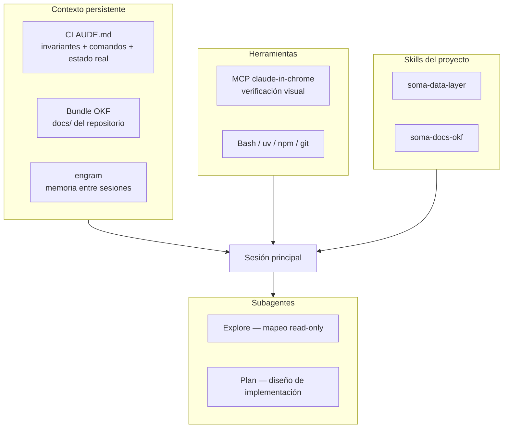

# Qué es esto

El "harness" es todo lo que rodea al modelo para que trabaje bien en este
repositorio: contexto persistente, herramientas, reglas verificables y división
del trabajo entre agentes. Sin él, cada sesión vuelve a cero y el criterio se
re-explica a mano — que es exactamente cómo se perdió la decisión de la Fase 0
durante el merge de integración.

# Estado tras esta sesión

## MCPs

| MCP | Uso real en este proyecto | Valor |
| --- | --- | --- |
| `claude-in-chrome` | Login, navegación del control room y captura de pantalla tras cada cambio de UI; lectura de consola para descartar errores | Alto. Es lo que permite verificar en vez de afirmar |
| `engram` | Memoria entre sesiones de decisiones y convenciones | Medio, infrautilizado |
| Gmail / Calendar / Drive | Ninguno | Nulo aquí |

**Falta:** un MCP de Postgres tras la migración de [ADR-004](/SOMA-ADR-004-postgres-pgvector.md),
para inspeccionar esquema y planes de consulta sin abrir un cliente aparte.

## Skills

Creadas en `.claude/skills/`:

| Skill | Cuándo se dispara |
| --- | --- |
| `soma-data-layer` | Tocar tablas, migraciones, repositorios o clasificación de datos |
| `soma-docs-okf` | Escribir o reorganizar documentación del bundle |

Existen además tres skills en `.opencode/skills/` (`soma-deployment`,
`soma-frontend`, `graphify`) que **Claude Code no lee**: son del harness OpenCode.
Su contenido de despliegue y frontend sigue siendo válido y conviene portarlo
para no mantener dos verdades.

## Orquestación de subagentes

Regla de reparto: **el subagente explora, la sesión principal decide y edita.**
Un subagente que edita archivos compite con el hilo principal por el mismo estado.

| Agente | Para qué | Cómo se usó aquí |
| --- | --- | --- |
| `Explore` | Localizar código y mapear hechos verificables. Read-only | Mapeo de acoplamiento e imports que fundamenta el ADR-003. Se le pidió citar `archivo:línea` y no proponer refactor — eso mantiene el reporte auditable |
| `Plan` | Diseñar una estrategia de implementación antes de escribir | No usado todavía; corresponde para la extracción de `domain/` |
| `general-purpose` | Búsquedas abiertas de varios pasos | No necesario hasta ahora |

Lo que hace útil a un `Explore`: pedirle **hechos con ubicación**, no opiniones.
El reporte que produjo encontró el ciclo `database ↔ repositories` y el stub de
`summary.py` — dos cosas que no estaban en la hipótesis inicial.

Advertencia aprendida: no lanzar un subagente sobre los mismos archivos que se
van a editar en paralelo. La edición de `App.jsx` se pospuso hasta que el
`Explore` terminó.

# Brechas

Ordenadas por lo que más cuesta su ausencia:

| # | Brecha | Consecuencia | Remedio |
| --- | --- | --- | --- |
| G1 | Las invariantes no se verifican solas | La Fase 0 se revirtió en un merge sin que nada lo detectara | Test que falle si el frontend referencia una ruta ausente en `main.py` |
| G2 | Sin test de dirección de capas | El dominio puede volver a acoplarse a FastAPI | Test que recorra imports de `domain/` (ver ADR-003) |
| G3 | Skills duplicadas en dos harness | Dos verdades divergentes | Portar `.opencode/skills` a `.claude/skills` |
| G4 | Logs sin estructura | Un fallo reportado no se puede correlacionar | Logging JSON con `request_id` |
| G5 | Docker nunca ejercitado | El despliegue se descubre en producción | Levantar compose y dejar constancia del resultado |
| G6 | Memoria infrautilizada | Se repiten preguntas ya resueltas | Guardar decisiones al cerrarlas, no al final |
| G7 | CI no valida arquitectura | Solo corre tests y build | Añadir G1 y G2 al workflow |

**G1 es la más barata y la que más habría ahorrado.** Un test que compare las
rutas que llama `src/` contra las registradas en `main.py` habría hecho fallar el
merge de integración en CI.

# Flujo de trabajo recomendado

1. **Contexto:** leer `CLAUDE.md` y buscar en el bundle OKF si hay un ADR sobre lo
   que se va a tocar. Una decisión registrada gana sobre una intuición nueva.
2. **Explorar antes de decidir:** para cambios que cruzan módulos, un `Explore`
   con instrucción de citar `archivo:línea`.
3. **Decidir en el hilo principal**, registrando el porqué en un ADR si la
   decisión sobrevive a la sesión.
4. **Editar y verificar de verdad:** `pytest` + `npm run build` + navegador. Una
   captura de pantalla vale más que una afirmación de que funciona.
5. **Cerrar:** actualizar el documento vivo que quedó desactualizado y guardar la
   decisión en memoria.

Regla que este proyecto ya pagó por aprender: **en un conflicto de merge donde un
lado elimina superficie, la eliminación puede ser la decisión.** Antes de preferir
el superset, buscar el ADR que la justifique.
