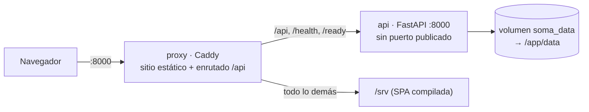
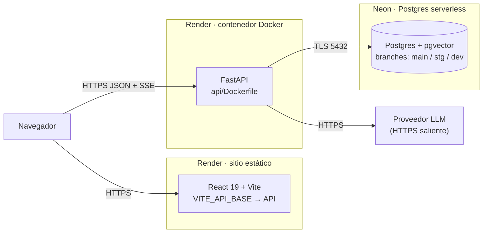
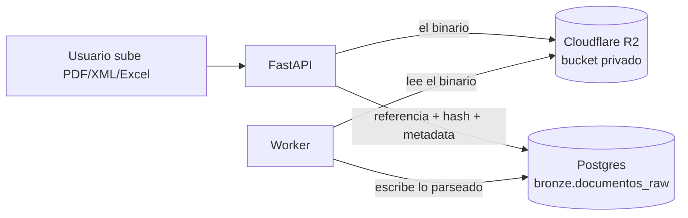

# Topología actual (local, Docker Compose)

`docker-compose.yml` define dos servicios y **está verificado**: se levantó y se
comprobaron `/`, `/ventas`, `/health`, `/ready`, el login y el flujo de APUs.

El proxy sirve además el sitio estático, así que web y API comparten origen y no
hace falta CORS en local.



| Servicio | Puerto host | Puerto interno | Expuesto | Rol |
| --- | --- | --- | --- | --- |
| `proxy` | `8000` | `80` | Sí | Único punto de entrada. Termina la conexión, comprime, y **desactiva el buffering de SSE** (`flush_interval -1`) |
| `api` | — | `8000` | **No** | FastAPI. Solo alcanzable desde la red de Compose |

Que `api` no publique puerto es correcto y deliberado: obliga a que todo el
tráfico pase por el proxy. El `Caddyfile` enruta solo `/api/*`, `/health` y
`/ready`.

**Para levantarlo hace falta Docker Desktop corriendo.** Verificación mínima:

```powershell
Copy-Item api\.env.example api\.env
docker compose up --build
curl http://127.0.0.1:8000/health     # {"status":"ok"}
curl http://127.0.0.1:8000/ready      # {"status":"ready"}
```

# Topología destino (producción)

Un solo proveedor de ejecución. Ver [ADR-008](/SOMA-ADR-008-stack-de-despliegue.md)
para por qué se descartaron Vercel y Railway.



Diferencias clave con local:

- **Caddy desaparece.** Render termina TLS y da dominio por servicio. La
  consecuencia incómoda: web y API pasan a ser **orígenes distintos**, así que
  CORS sí hace falta en producción aunque en local no.
- **El puerto lo asigna la plataforma.** Render inyecta `PORT`; el `CMD` debe
  respetarlo (`--port ${PORT:-8000}`), no fijar 8000.
- **El volumen desaparece** al migrar a Neon: el estado sale del contenedor, que
  pasa a ser efímero y reemplazable.
- **Hoy todavía no es así.** El API corre con `DATABASE_PATH` sobre SQLite en
  disco efímero: la base se reinicia en cada despliegue. Sirve para probar, no
  para datos reales. Lo resuelve [ADR-004](/SOMA-ADR-004-postgres-pgvector.md).

## Variables por entorno

| Variable | Render · web | Render · API | Nota |
| --- | --- | --- | --- |
| `VITE_API_BASE` | OK | — | Única variable del frontend. Pública por definición |
| `DATABASE_PATH` | — | OK | Hoy: ruta del SQLite efímero |
| `DATABASE_URL` | — | OK | Destino: cadena de Neon, incluye la branch |
| `JWT_SECRET` | — | OK | Render lo genera y lo mantiene entre despliegues |
| `CORS_ORIGINS` | — | OK | Dominio exacto del sitio de Render |
| `ALLOWED_HOSTS` | — | OK | Dominio del API en Render |
| `AGENT_API_KEY` | — | OK | Nunca en `VITE_*` |
| `ENVIRONMENT` | — | OK | `production` obliga a `JWT_SECRET` propio |


# Quién hace qué: Render y Neon

Es la confusión más común y vale aclararla: **no compiten**. Son dos capas
distintas y cada una hace algo que la otra no.

| Capa | Qué guarda o ejecuta | Proveedor |
| --- | --- | --- |
| Sitio web | HTML, CSS, JS ya compilados. No tiene estado | **Render** (static) |
| Backend | El proceso FastAPI: recibe peticiones, calcula, responde | **Render** (docker) |
| Base de datos | Los datos que sobreviven a un reinicio | **Neon** (Postgres gestionado) |

- **Neon no compite con Render.** Es *dónde viven los datos*. Render también
  ofrece Postgres, pero Neon escala a cero, incluye `pgvector` y da branches por
  entorno, que es lo que pide [ADR-004](/SOMA-ADR-004-postgres-pgvector.md).
- **Un solo proveedor de ejecución es deliberado**: un dashboard, una factura,
  un sitio donde mirar logs. A escala de un usuario, repartir web y API entre
  dos proveedores añade coordinación sin comprar nada.

Analogía: Render es la vitrina y la cocina; Neon es la despensa.

# Dónde van los PDF y los Excel

**No en Postgres.** Guardar binarios en la base la infla, encarece cada backup
y consume el plan gratuito de Neon (0,5 GB) en pocas decenas de facturas.

La regla del gobierno de datos: **el archivo va a almacenamiento de objetos, la
base guarda la referencia.**



En `bronze.documentos_raw` se guarda: `storage_key`, `content_hash` (SHA-256),
`nombre_original`, `mime`, `bytes`, `ingested_at`. El `content_hash` da
idempotencia: subir dos veces el mismo archivo no duplica filas.

**Proveedor recomendado: [Cloudflare R2](https://developers.cloudflare.com/r2/).**
10 GB gratis y **cero coste de egreso**, que es lo que hace impredecible la
factura de S3. Backblaze B2 es más barato por GB almacenado, pero conviene solo
si los archivos casi nunca se leen.

El bucket es **privado**. El navegador nunca accede directo: pide el archivo al
API, que valida sesión y devuelve una URL firmada de corta duración.

# Cómo depurar cuando ya esté desplegado

En local, contra el compose:

```powershell
docker compose logs -f api          # una linea JSON por peticion
docker compose logs -f api | Select-String '"status": 5'   # solo errores
docker compose exec api sh          # entrar al contenedor
docker compose ps                   # estado y healthcheck
```

Ya desplegado, el flujo es el mismo porque el logging es idéntico:

1. El usuario reporta un fallo y ve un `request_id` en el mensaje de error.
2. Se busca ese `request_id` en los logs del proveedor (`railway logs`).
3. Esa línea trae ruta, status y duración; las líneas cercanas, la excepción.

Por eso el logging estructurado importa: sin `request_id` hay que adivinar cuál
de miles de líneas corresponde a la queja.

**Sondas:** `/health` responde si el proceso vive; `/ready` responde si además
la base está migrada y accesible. El orquestador debe usar `/ready` para decidir
si enviar tráfico, y `/health` para decidir si reiniciar.

# Costos mensuales estimados

Para **un usuario**, tráfico bajo y una base pequeña. Precios de agosto 2026.

| Componente | Plan | Coste/mes |
| --- | --- | --- |
| Frontend (Render static) | Free | **$0** |
| Backend (Render web) | Free | **$0** — duerme, ver abajo |
| Postgres + pgvector (Neon) | Free | **$0** (0,5 GB, 100 CU-h, scale-to-zero) |
| Dominio `.com` | anual ~$12 | **~$1** |
| LLM | por uso | **$0–10** según conversaciones |
| | **Total** | **~$1–11 / mes** |

El único coste que no es opcional es el dominio. Todo lo demás es plan gratuito
y con uso comercial permitido.

## Los tres límites que sí importan

- **El API gratuito de Render duerme** tras un rato sin tráfico, y la primera
  petición después tarda decenas de segundos. Aceptable para demos y uso
  esporádico; deja de serlo el día que alguien lo use a diario. Salida: plan
  Starter, **$7/mes**, y deja de dormir. Es el primer gasto que va a aparecer, y
  aparecerá por uso real, no por crecer.
- **Neon Free son 0,5 GB.** Los PDF originales la llenan rápido. Por eso los
  binarios no van en Postgres: van a almacenamiento de objetos y en la base solo
  queda la referencia y el hash.  Siguiente escalón: Launch $19/mes.
- **El LLM** es el único coste que crece con el uso real del asesor.

## Lo que este stack ya evitó

El plan Hobby de Vercel es **solo para uso no comercial**. SOMA sirve trabajo
facturable de un despacho, así que habría correspondido Pro a **$20/mes** — más
que todo el resto junto. Render static es gratuito y permite uso comercial. Ver
[ADR-008](/SOMA-ADR-008-stack-de-despliegue.md).

# Observabilidad y depuración

Base actual: `X-Request-ID` en toda respuesta, `audit_events` con redacción de
secretos, `/health` y `/ready` diferenciados.

Falta, en orden de valor:

1. **Logs estructurados en JSON** con `request_id`, ruta, status y duración. Hoy
   el logging es el de uvicorn por defecto: no se puede correlacionar una queja
   con una traza.
2. **Propagar `request_id` al frontend** y mostrarlo en el mensaje de error, para
   que un reporte de fallo traiga el identificador que lo localiza en los logs.
3. **Alertas** sobre 5xx, latencia p95 y fallos de backup.
4. **Prueba de restauración** del backup. Un backup no probado no es un backup.

# Diagrama editable

El diagrama maestro está en [`/diagrams/soma-architecture.drawio`](/diagrams/soma-architecture.drawio),
en XML plano. Se abre en [diagrams.net](https://app.diagrams.net) sin instalar
nada. Los diagramas de estos documentos son Mermaid, que se versiona como texto y
renderiza directo en GitHub.
